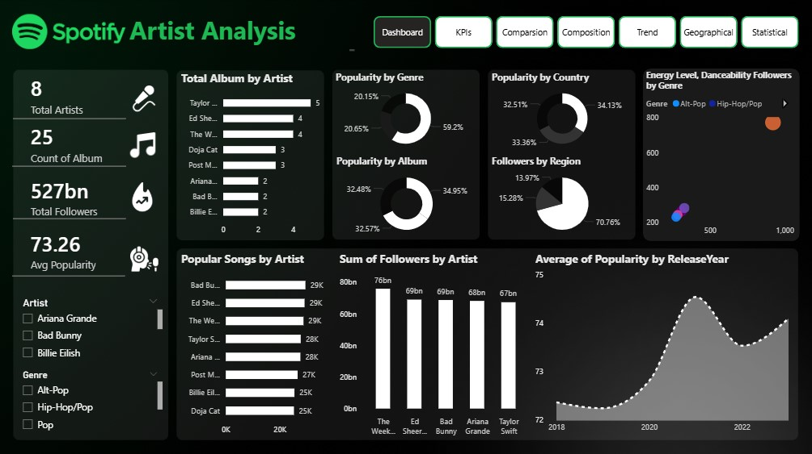
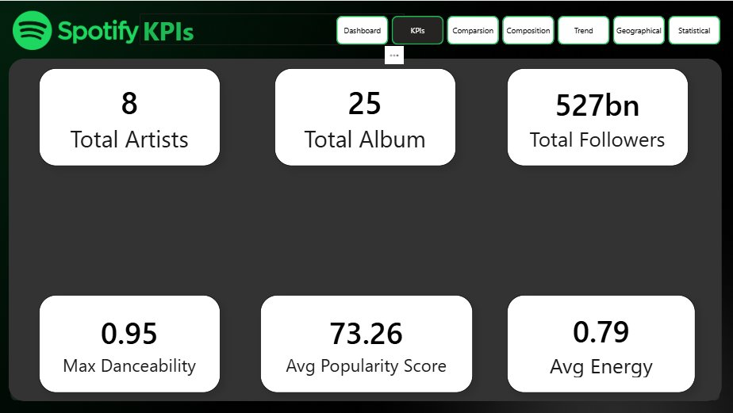
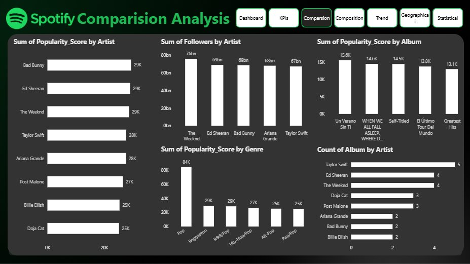
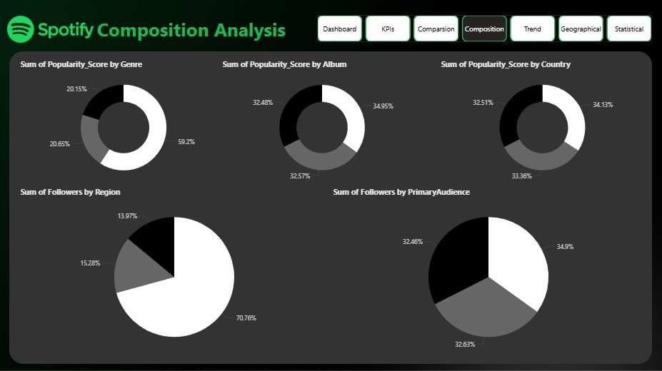
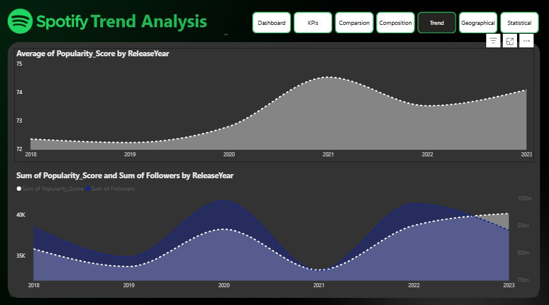
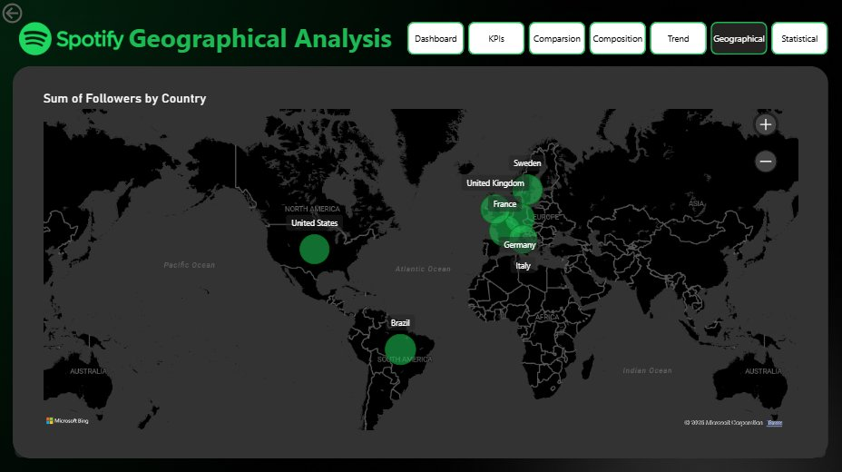
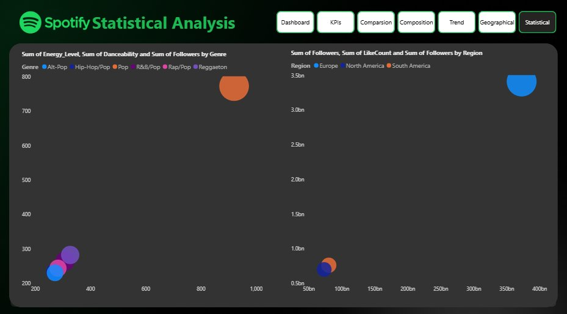

# 🎵 Spotify Artist Analysis & Performance Dashboard (2025)

A comprehensive **Power BI Business Intelligence project** analyzing Spotify artist performance across 8 major artists, 25 albums, and 527 billion combined followers. The dashboard transforms raw streaming data into strategic insights for music industry stakeholders.

**Prepared by:** Romaan Uddin Siddiqui  
**Tools:** Power BI Desktop · Power Query · DAX

---

## 🖥️ Dashboard Preview

### Main Dashboard


### KPIs


### Comparison Analysis


### Composition Analysis


### Trend Analysis


### Geographical Analysis


### Statistical Analysis


---

## 📁 Project Files

| File | Description |
|------|-------------|
| `Spotify_BRD.docx` | Business Requirements Document defining scope, KPIs, stakeholders, and success criteria |
| `Spotify_Artist_Analysis_Report.docx` | Full project report with methodology, key findings, and strategic recommendations |
| Power BI Dashboard (`.pbix`) | 7-page interactive dashboard with slicers for Artist and Genre |

---

## 🎯 Project Objectives

- Monitor **follower growth and popularity scores** across 8 artists and 25 albums
- Analyze **popularity trends by release year** (2018–2023) to understand listener behavior
- Break down performance by **region and country** to identify key geographic markets
- Correlate **musical attributes** (Energy, Danceability) with follower engagement
- Enable **side-by-side artist comparisons** to benchmark top performers

---

## 📊 Key Metrics (KPIs)

| KPI | Value |
|-----|-------|
| 🎤 Total Artists | 8 |
| 💿 Total Albums | 25 |
| 👥 Total Followers | 527 Billion |
| ⭐ Avg Popularity Score | 73.26 |
| 💃 Max Danceability | 0.95 |
| ⚡ Avg Energy Level | 0.79 |

---

## 🔍 Key Findings & Insights

### 🏆 Artist Performance
- **Taylor Swift** leads with the most albums (5) and highest consistent popularity
- **The Weeknd, Ed Sheeran, and Bad Bunny** are tied for top popularity scores (~29K each)
- **The Weeknd** has the highest total followers at 76 billion

### 🎸 Genre Insights
- **Pop dominates** with 59.2% of total popularity — the primary engagement driver
- **Reggaeton and R&B/Pop** each contribute ~29K popularity scores, showing strong cross-genre appeal
- High-energy, high-danceability tracks in **Alt-Pop and Hip-Hop/Pop** correlate with significantly higher follower counts

### 🌍 Geographic Insights
- **70.76% of followers** are concentrated in a single dominant region — indicating high geographic risk and expansion opportunity
- Key markets include: **United States, Brazil, France, Germany, and the United Kingdom**
- Europe accounts for the largest follower share (~3.5bn) among tracked regions

### 📈 Trend Analysis
- **Popularity peaked in 2021** (~74.5 avg) after steady growth from 2018
- Post-2021 stabilization suggests **market maturation** — continuous new releases are essential
- Follower counts and popularity scores move in **similar cycles**, peaking together in 2021–2022

### 🎯 Strategic Recommendations
- **Invest in All-Pop content** — it drives 59.2% of engagement; prioritize artist signings in this genre
- **Launch campaigns in underperforming regions** to reduce the 70.76% geographic concentration risk
- **Prioritize high-energy, high-danceability tracks** — they consistently outperform in follower acquisition
- **Use Taylor Swift and Ed Sheeran as benchmarks** for mentoring emerging artists
- **Target emerging markets** (underrepresented countries on the geo map) for regional partnership campaigns

---

## 🛠️ Tools & Skills Used

- **Power BI Desktop** — Dashboard development, data modeling, multi-page report design
- **Power Query** — Data transformation and preparation
- **DAX (Data Analysis Expressions)** — Custom measures for Total Followers, Avg Popularity, and aggregations
- **Data Analysis** — Genre segmentation, trend analysis, geographic distribution, correlation analysis

---

## 📋 Dashboard Pages

| Page | Description |
|------|-------------|
| **Dashboard** | Main overview with all key charts and KPI tiles |
| **KPIs** | Dedicated KPI summary page |
| **Comparison** | Artist vs. artist popularity, followers, and album count |
| **Composition** | Donut/pie charts for genre, album, country, region, audience breakdown |
| **Trend** | Popularity and follower trends by release year (2018–2023) |
| **Geographical** | World map showing follower distribution by country |
| **Statistical** | Bubble/scatter charts correlating energy, danceability, and followers |

---

## 🔄 Project Workflow

```
Spotify Dataset (Static — 8 Artists, 25 Albums)
        ↓
Power Query (Data Cleaning & Transformation)
        ↓
DAX Measures (KPI Calculations)
        ↓
Power BI Dashboard (7 Interactive Pages)
        ↓
Stakeholders: Music Label Executives, Marketing Teams, Talent Scouts
```

---

## 👤 Author

**Romaan Uddin Siddiqui** — Aspiring Data Analyst  
📍 Bhopal, Madhya Pradesh  
🔗 [GitHub Profile](https://github.com/rumman49)

---

## 💬 Feedback

Feel free to open an [issue](https://github.com/rumman49/Spotify-Trends-Artist-Performance-Analysis/issues) or connect via GitHub with questions or suggestions.
